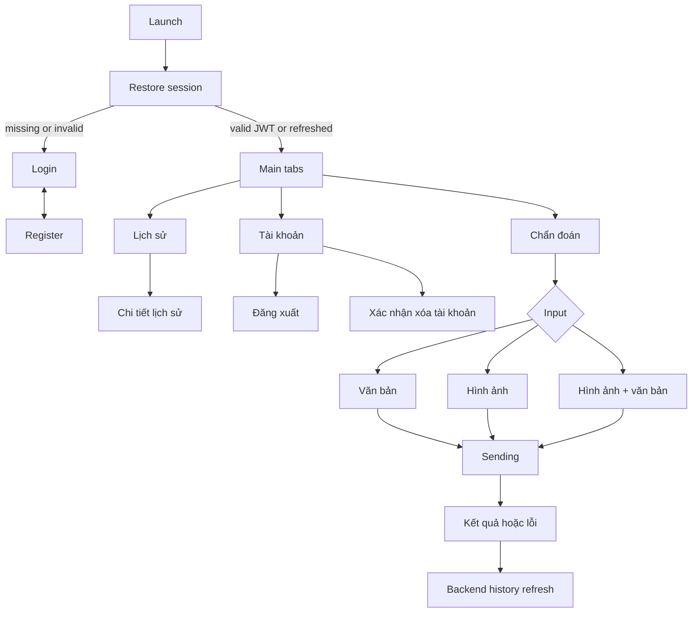

# UI and navigation flow

The main navigation has exactly three tabs: **Chẩn đoán**, **Lịch sử**, and **Tài khoản**. History detail is a nested stack screen. Authentication state chooses the auth or protected stack, so Back cannot return to Login after successful login.

The diagnosis composer supports text-only, image-only, and combined input; gallery and camera selection are platform-aware. Because the audited backend exposes none of the diagnosis/history routes, submission currently ends in an explicit server-capability error and no local fake result/history is created.

Not present by design: disease notebook, disease encyclopedia, admin dashboard, user management, role editor, and disease CRUD.
